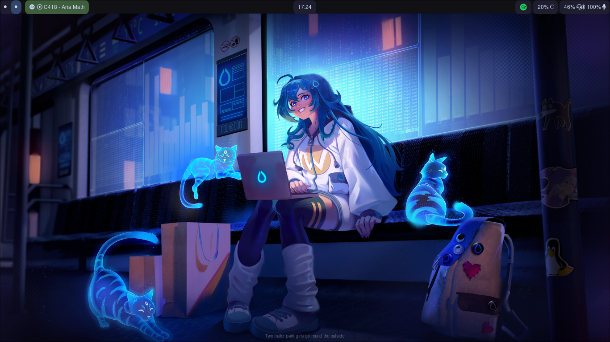

# João's custom Waybar
My personal waybar configuration that I use everyday! Colors are based on the [Catppuccin Mocha Palette](https://github.com/catppuccin)

## Pre-requisites
### Media
For making the media widget work, you first need the [mediaplayer.py](https://github.com/Alexays/Waybar/blob/master/resources/custom_modules/mediaplayer.py) 
script included in the [Waybar repo](https://github.com/Alexays/Waybar). You can copy this script to the `~/.config/waybar/` directory(if you don't have 
this folder, you can create one with `mkdir ~/.config/waybar`).
After putting the script in place, you need [playerctl](https://github.com/altdesktop/playerctl) to control the media(play/pause, foward and backwards).
### Audio
To control the audio, I use [pavucontrol](https://github.com/pulseaudio/pavucontrol), the Waybar's default audio manager. You can use any other of your preference, 
just change the `"on-click"` value inside `"pulseaudio"` in the `config.jsonc` file to your desired application.

## Issues
Got any issue? Please report it at the [Issues Tab](https://github.com/retrozinndev/waybar/issues/new), I'll be happy for helping you out!
