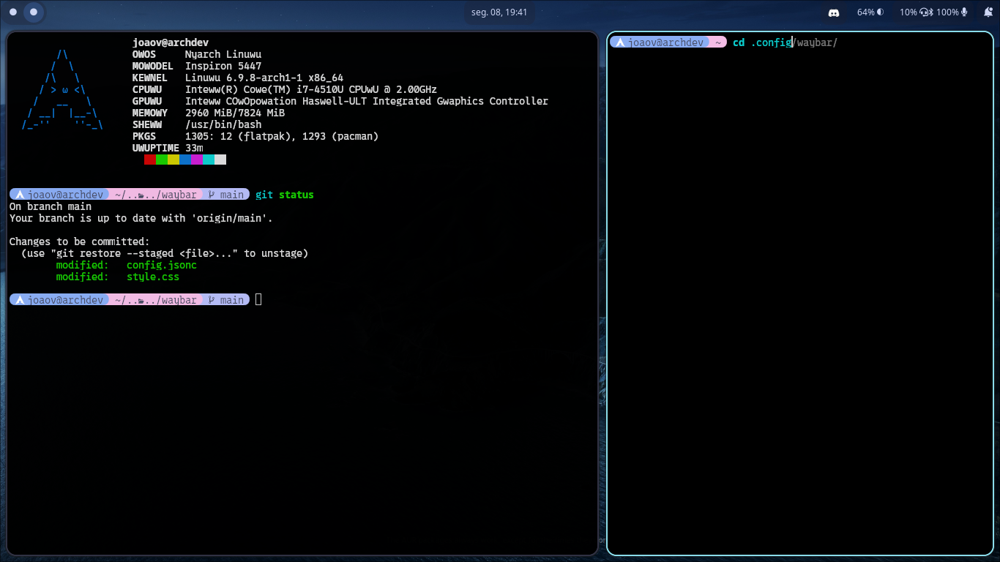

# João's custom Waybar
My personal waybar configuration that I use everyday! Colors are based on the [Catppuccin Mocha Palette](https://github.com/catppuccin)

<div class="images">
    
</div>
## Pre-requisites
### Media
For making the media widget work, you first need the [mediaplayer.py](https://github.com/Alexays/Waybar/blob/master/resources/custom_modules/mediaplayer.py) 
script included in the [Waybar repo](https://github.com/Alexays/Waybar). You can copy this script to the `~/.config/waybar/` directory(if you don't have 
this folder, you can create one with `mkdir ~/.config/waybar`).
After putting the script in place, you need [playerctl](https://github.com/altdesktop/playerctl) to control the media(play/pause, foward and backwards).

### Audio
To control the audio, I use [pavucontrol](https://github.com/pulseaudio/pavucontrol), the Waybar's default audio controller. You can use any other of your preference, 
just change the `"on-click"` value inside `"pulseaudio"` in the `config.jsonc` file to your desired application.

### Notifications
To manage notifications, I use [swaync(SwayNotificationCenter)](https://github.com/ErikReider/SwayNotificationCenter), you can use another if you want, changing the `custom/notifications` section in the `config.jsonc` to your preference.


## Functionalities
### Play/pause media
To do that, you can simply click in the Spotify/Media application widget in waybar:


Clicking in the widget will toggle play/pause actions, you need [playerctl](https://github.com/altdesktop/playerctl) in order to make this work.

### Battery status
The Battery status widget will only appear if its percentage is below 100%. This is made for preserving space on waybar.

## Installation
You can simply copy `mocha.css`, `style.css` and `config.jsonc` to your waybar directory and restart waybar.

### Fast install
In order to install this style right away, just run this command line, according to your shell:
> ℹ️ Notice: both scripts will make a backup folder: `~/.config/waybar/bkp`, containing all previous waybar files.

#### Bash / sh / zsh
```sh
 $ git clone https://github.com/retrozinndev/waybar && cd waybar && sudo mkdir ~/.config/waybar/bkp && sudo cp ~/.config/waybar/style.css ~/.config/waybar/config.jsonc ~/.config/waybar/bkp && cp style.css mocha.css config.jsonc ~/.config/waybar
```

#### Nushell
```nushell
 $ git clone https://github.com/retrozinndev/waybar; cd waybar; sudo mkdir ~/.config/waybar/bkp; sudo cp ~/.config/waybar/style.css ~/.config/waybar/config.jsonc ~/.config/waybar/bkp; cp style.css mocha.css config.jsonc ~/.config/waybar
```

## Issues
Got any issue? Please report it at the [Issues Tab](https://github.com/retrozinndev/waybar/issues/new), I'll be happy for helping you out!
